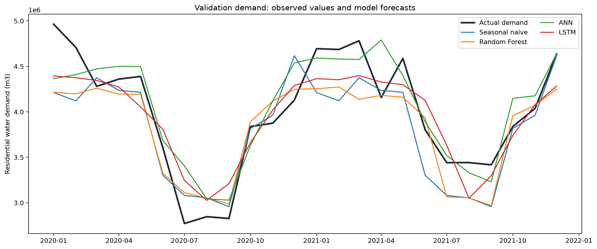
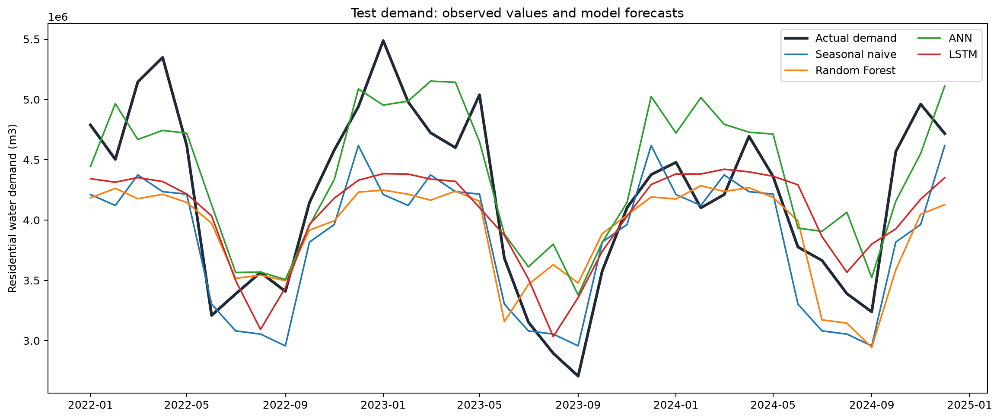
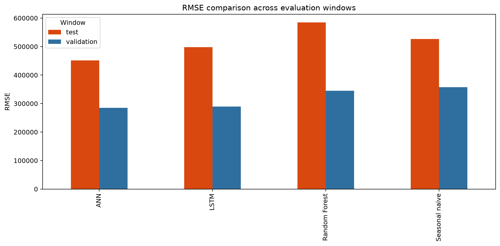
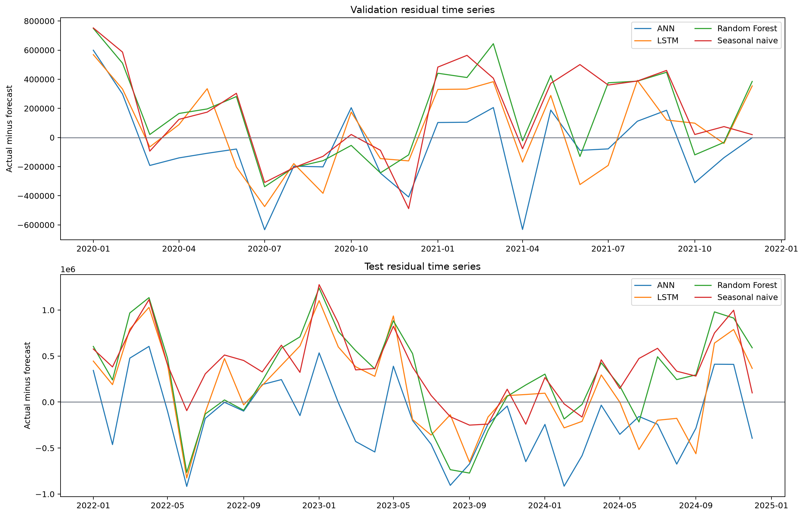
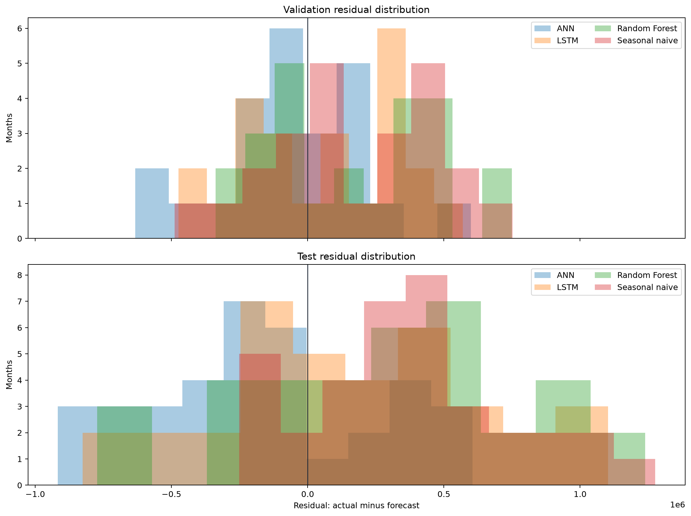
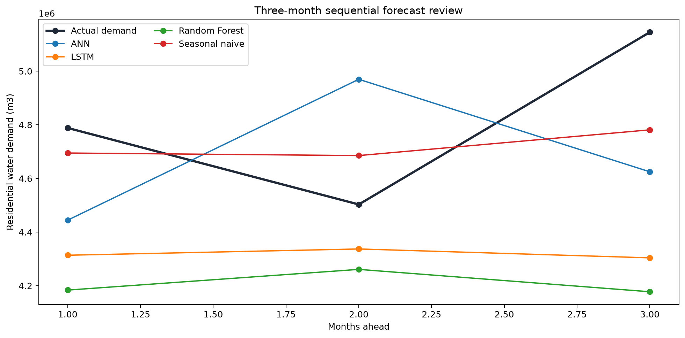
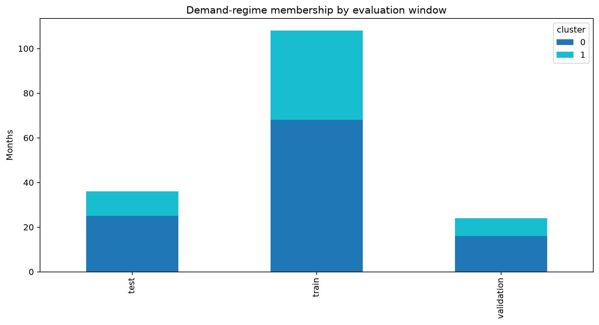
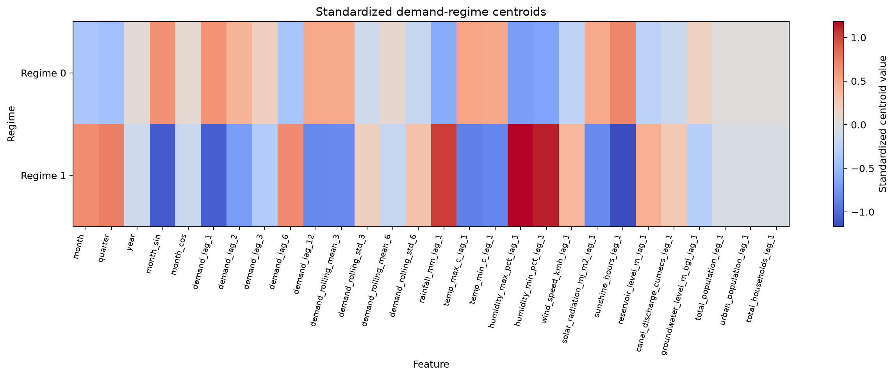
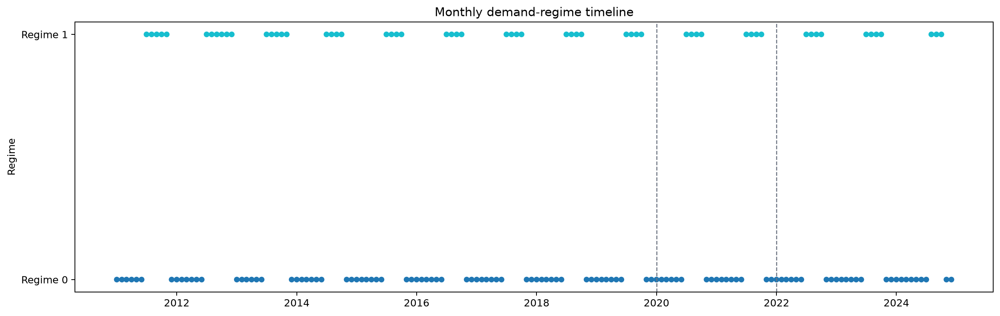

# Monthly Residential Water-Demand Forecasting for DNH Total

## Executive Summary

This project develops and validates a reproducible monthly residential water-demand forecasting pipeline for the combined Dadra and Nagar Haveli study area (`DNH_total`). The implementation uses a synthetic Version 2 dataset as a controlled benchmark and follows a chronological forecasting design with training, validation, and untouched test periods.

The completed workflow covers data-contract definition, synthetic data generation, exploratory analysis, leakage-safe feature engineering, baseline and machine-learning forecasting, residual analysis, short-horizon forecasting, and exploratory demand-regime analysis.

On the current synthetic test period, the ANN achieved the lowest RMSE and MAE among the four completed models. The ANN also led on the validation period, and the LSTM retained the second position on both windows. The seasonal-naive baseline remains an important comparator: the ANN improved test RMSE by approximately 14.3% relative to that baseline, while the LSTM improved it by approximately 5.4%. Random Forest did not improve on the test-period seasonal baseline.

These results demonstrate pipeline behavior on synthetic data. They are not evidence of operational forecasting accuracy and must be reassessed after real historical data is introduced.

## 1. Study Context and Scope

The project addresses monthly residential water-demand forecasting at the combined DNH-total level. The approved target is residential demand in cubic metres per month. The modelling grain is one row per calendar month with a single geographic identifier, `DNH_total`.

The system is designed to answer practical research questions:

- Can a common feature matrix support comparable forecasting models?
- Do advanced models improve on a seasonal-naive reference?
- How stable are errors across time, calendar month, and demand regime?
- How does recursive forecast error change across a three-month horizon?
- Which parts of the workflow must be revisited when real data becomes available?

Agricultural variables, geographic zone identifiers, water-quality fields, and unconfirmed consumption measures are excluded from the approved modelling scope.

## 2. Data and Experimental Design

The synthetic benchmark contains 180 consecutive monthly observations from January 2010 through December 2024. After the feature warm-up period required by the 12-month lag structure, 168 complete modelling rows remain.

The chronological partitions are:

- Training: 108 months, January 2011 to December 2019
- Validation: 24 months, January 2020 to December 2021
- Test: 36 months, January 2022 to December 2024

No random time-series shuffling is used. The test period is held back for final comparison after validation-based model selection.

The canonical data contract and quality rules are documented in [DATA_CONTRACT.md](DATA_CONTRACT.md). The generated dataset is validated for monthly continuity, DNH-total geography, numeric completeness, physical bounds, positive demand, demographic relationships, state-variable behavior, and configured realism constraints.

## 3. Feature Engineering

The shared feature matrix contains 28 predictors. It combines:

- Calendar variables, including month, quarter, year, and cyclic month encodings
- Historical demand lags at one, two, three, six, and twelve months
- Historical rolling means and standard deviations over three- and six-month windows
- Lagged rainfall, temperature, humidity, wind, solar radiation, sunshine, reservoir, canal, groundwater, and demographic variables

Target-derived predictors use prior observations only. Scaling, model fitting, tuning, and selection are restricted to training information. The shared matrix and split metadata are persisted under `data/processed/features/` and `data/processed/splits/`.

## 4. Forecasting Models

Four completed forecasting approaches are compared:

- Seasonal naive baseline using recurring month-of-year behavior
- Random Forest using the shared tabular feature matrix
- Artificial neural network using training-only scaling
- Long short-term memory network using ordered sequences and training-only scaling

The models use common validation and test windows. The evaluation reports MAE, RMSE, MAPE, sMAPE, and R-squared where meaningful. A generic accuracy percentage is not used.

## 5. Results

### 5.1 Validation performance

The ANN led the validation window with RMSE of approximately 284,796 m3 and MAE of approximately 227,345 m3. The LSTM followed closely on RMSE at approximately 289,081 m3. Random Forest and the seasonal-naive baseline were less accurate on this window.

Relative to the seasonal baseline on validation:

- ANN reduced MAE by approximately 22.1% and RMSE by approximately 20.4%
- LSTM reduced MAE by approximately 12.4% and RMSE by approximately 19.2%
- Random Forest reduced MAE by approximately 2.0% and RMSE by approximately 3.5%

### 5.2 Test performance

The ANN remained the test-period leader with RMSE of approximately 450,990 m3, MAE of approximately 375,857 m3, and R-squared of approximately 0.609. The LSTM followed with RMSE of approximately 497,992 m3 and MAE of approximately 404,871 m3.

Relative to the seasonal-naive baseline on test:

- ANN reduced MAE by approximately 13.3% and RMSE by approximately 14.3%
- LSTM reduced MAE by approximately 6.7% and RMSE by approximately 5.4%
- Random Forest increased MAE by approximately 12.1% and RMSE by approximately 11.0%

The ANN and LSTM rankings were stable between validation and test. Random Forest moved below the seasonal baseline on test, while the seasonal baseline moved above it.

The authoritative values are available in [phase6_scorecard.csv](../outputs/metrics/phase6_scorecard.csv), [phase6_baseline_comparison.csv](../outputs/metrics/phase6_baseline_comparison.csv), and [phase6_selection_review.csv](../outputs/metrics/phase6_selection_review.csv).

## 6. Forecast Visual Evidence

The following figures are generated from saved predictions and evaluation artifacts.

### Observed demand and model forecasts

### Metric comparison

The figures show the relative positioning of the four models against observed demand. They should be read together with the persisted metric files rather than treated as substitutes for numerical evaluation.

## 7. Residual and Uncertainty Analysis

Residuals are defined as actual demand minus forecast demand. The analysis reports mean residual, residual standard deviation, MAE, RMSE, maximum absolute error, and central residual quantiles.

The residual results show that model behavior differs by window. The ANN has a negative test-period mean residual, indicating a tendency toward underprediction on average in the synthetic test period. The seasonal baseline and LSTM have positive test-period mean residuals, indicating average overprediction. These are descriptive benchmark findings, not causal conclusions.

Residual time-series and distribution figures are available here:

Seasonal error summaries and the largest-error months are persisted in [phase6_seasonal_errors.csv](../outputs/reports/phase6_seasonal_errors.csv) and [phase6_large_errors.csv](../outputs/reports/phase6_large_errors.csv).

## 8. Short-Horizon Forecasting

The horizon workflow generates one-month-ahead and three-month sequential forecasts from the first held-out test origin. Recursive forecasts replace target-derived lags and rolling values with prior predictions as the horizon advances.

The persisted quarterly artifact contains the sum of the three monthly forecasts and the corresponding sum of the three actual monthly demands. No separate quarterly model is fitted.

The seasonal-naive model has the smallest one-month absolute error in the current horizon example, while its aggregate three-month error remains substantially higher than its first-month error. The ANN has a larger first-month error in this horizon example but remains competitive on aggregate three-month error.

The supporting artifacts are [phase5_horizon_forecasts.csv](../outputs/reports/phase5_horizon_forecasts.csv), [phase5_quarterly_forecasts.csv](../outputs/reports/phase5_quarterly_forecasts.csv), and [phase6_horizon_review.csv](../outputs/metrics/phase6_horizon_review.csv).

## 9. Exploratory Demand-Regime Analysis

An exploratory K-Means model is fitted to training-period standardized feature inputs. Validation and test months are assigned to the fitted regime space without refitting. The clustering describes monthly demand behavior and is not geographic clustering or a default predictive feature.

The selected solution contains two regimes with a training silhouette score of approximately 0.275. Regimes are named using standardized demand level and variability characteristics. The persisted regime artifact includes the scaler and K-Means model as a single pipeline, along with candidate cluster diagnostics, feature metadata, centroids, and assignments.

Regime-specific model errors are available in [phase6_regime_error_summary.csv](../outputs/metrics/phase6_regime_error_summary.csv). These relationships are exploratory and should be independently reassessed with real observations.

## 10. Reproducibility and Quality Controls

The repository includes:

- Source data and split integrity checks
- Saved model, prediction, metric, configuration, and diagnostic artifacts
- Checksummed Phase 5 and Phase 6 manifests
- Environment metadata and a locked dependency file
- Regression tests for data generation, feature engineering, models, horizon forecasting, evaluation, packaging, and regime analysis
- Presentation notebooks covering data preparation, models, comparison, horizon behavior, and evaluation

The final Phase 6 package is represented by [phase6_artifact_manifest.json](../outputs/reports/phase6_artifact_manifest.json), and its handoff summary is in [phase6_handoff_manifest.md](../outputs/reports/phase6_handoff_manifest.md).

## 11. Limitations

The principal limitation is that the benchmark data is synthetic. The generator is deterministic and designed to provide realistic structure, but it cannot establish the behavior of the real DNH residential-demand system.

Additional limitations include:

- The real target definition, reporting calendar, missingness, and coverage still require confirmation.
- Feature availability and leakage controls must be reassessed after real-data replacement.
- Model rankings and demand regimes may change on real observations.
- Residual quantiles are descriptive error summaries, not operational confidence intervals.
- Regime relationships do not establish causality.
- The current evaluation covers one synthetic benchmark realization and fixed chronological windows.

## 12. Conclusion

The repository provides a complete, reproducible synthetic-first forecasting implementation for monthly DNH-total residential water demand. Under the current benchmark, ANN provides the strongest overall test-period performance, LSTM is a stable secondary model, and the seasonal-naive baseline remains essential for interpretation.

The implementation is ready to support final project reporting, provided all claims remain explicitly bounded by the synthetic-data limitation. Real-data replacement remains a separate future activity requiring renewed data validation, feature review, model selection, and evaluation.

## Reproduction Entry Point

See [REPOSITORY_WALKTHROUGH.md](REPOSITORY_WALKTHROUGH.md) for repository navigation and the complete Windows-oriented execution sequence.
